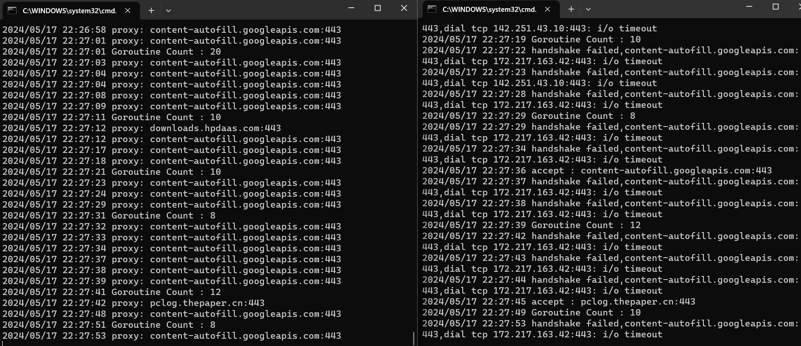

# vpn
http or https proxy
http https 代理工具 

用于支持 http和https代理工具,根据自定义协议进行加密传输
包含客户端和服务端

## 开始使用
#### 服务端
`
./proxy -mode=server -port=:8888
`

#### 客户端
`
./proxy -mode=server -port=:9999 -addr=127.0.0.1:8888
`

`
-mode 运行方式 server client 
-port 侦听端口 端口请带:
-addr 服务器地址 mode 为client需配置此参数
`

### 客户端 和 服务器 采用私有自定义协议 比较简陋

`
练手代理工具,请不要用于翻墙,违法活动.有问题请帮忙指正.提issue
`

## 截图

